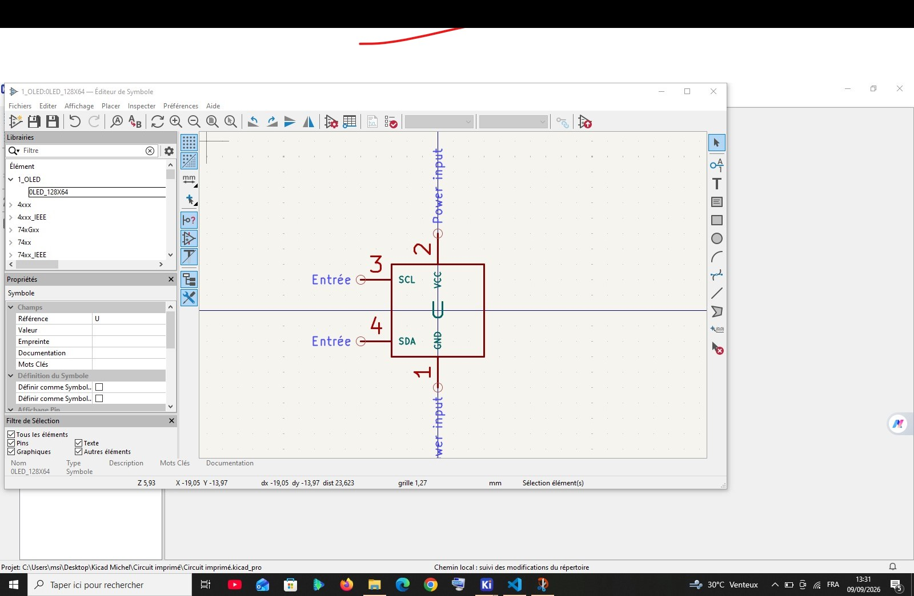
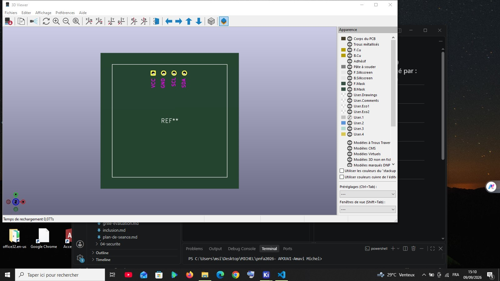

## Journal du Mercredi 09 Septembre 2026( rédigé par : APOUVI Amavi Michel)
# Fait aujourd'hui
- Réalisation d'un circuit avec **KiCad** 
- utilisation de **KiCad** pour éditer un symbole  et un emprunte 
- Assigné les empruntes aux éléments de notre circuit 
# Appris 
- J'ai appris à éditer un symbole et un emprunte d'un élément avec **KiCad**
# à faire demain 
- Travail de groupe pour avancer sur nos projet de groupe
- ( signé) : Amavi Michel