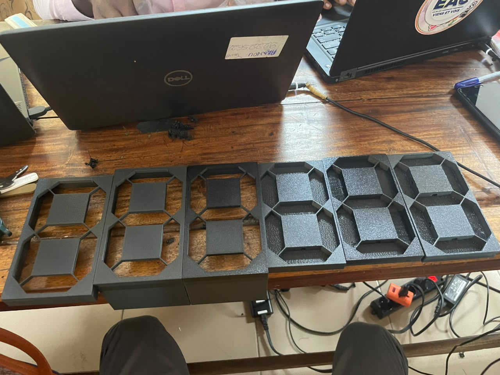
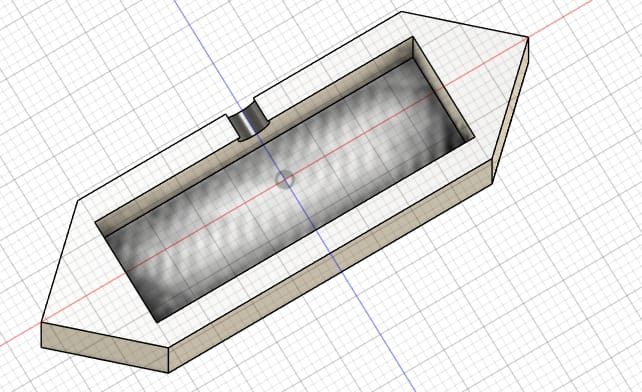

## Journal du Jeudi 10 Septembre 2026(rédigé par: APOUVI Amavi Michel)
# Fait Aujourd'hui
- réception de quelques matériels pour le travail de groupe 
- Impression 3D des boitier des Afficheurs LED  
- Modélisation 3D pour assembler avec les boitier des afficheur 
# Appris
- J'ai appris à enroulé et mettre un filament dans l'imprimente 3D
# Décidé
- Faire encore plus de recherche sur notre projet 
# à faire demain 
- non communiquer
- [signé] : Amavi Michel