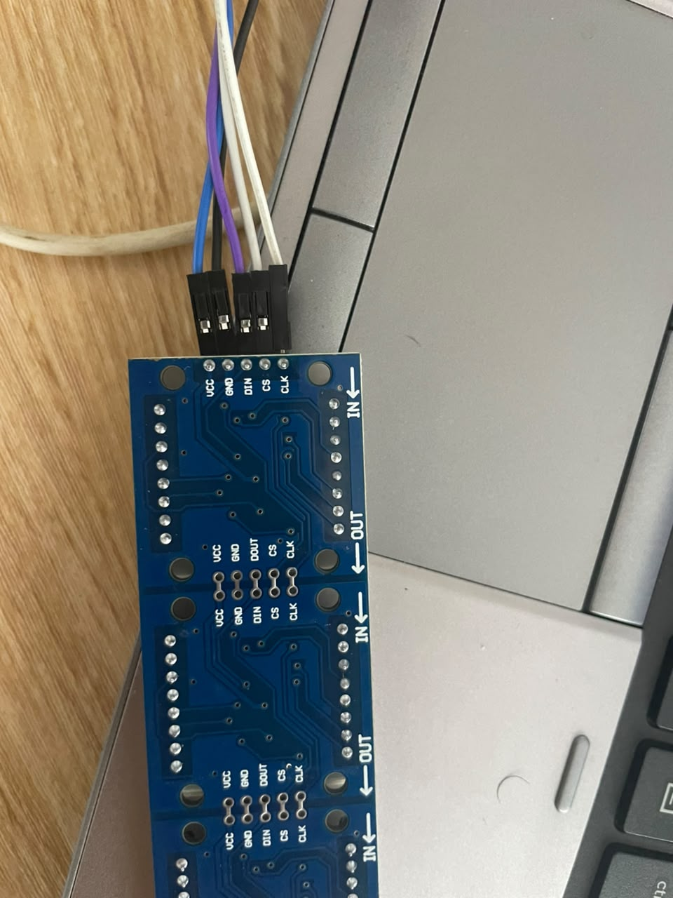
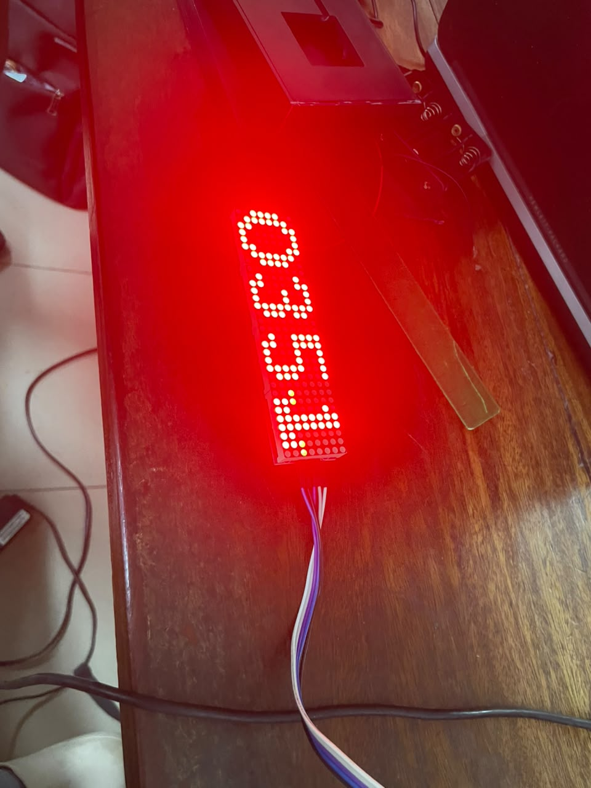
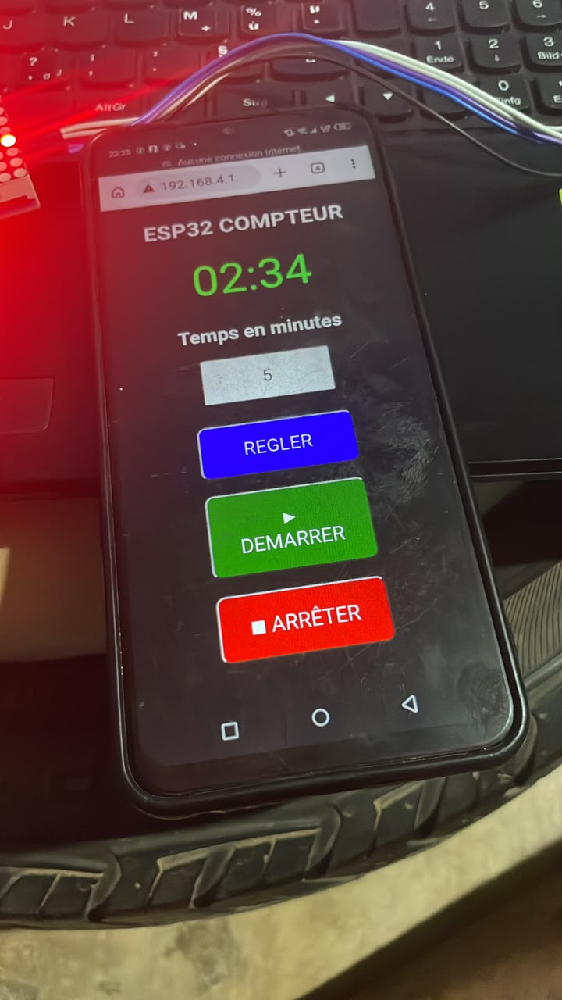

## Journal du vendredi 11 septembre 2026 (rédigé par : APOUVI Amavi Michel)
# Fait aujourd'hui
- impression du reste 
- Avancement sur le projet de groupe
- Connexion entre un **XIAO ESP32** et un **LED MATRIX**  pour affiché les décompte de minuites et secondes en vue d'essaie pour l'affichage du Temps de jeu de notre ptojet **Tableau de score** 
# Appris 
- J'ai appris à faire  la connexion  entre un **XIAO ESP32** et un **LED MATRIX**
- J'ai appris à faire le compte et le décompte  sur la **LEDMATRIX** avec un code python. 
- J'ai appris à faire la connexion entre le point d'accès de **ESP32** et un téléphone : commander le ESP  depuis un téléphone 
# Raté,puis corrigé
- La concception du boitier de notre projet 
# Décidé 
# à faire demain 
- non communiqué