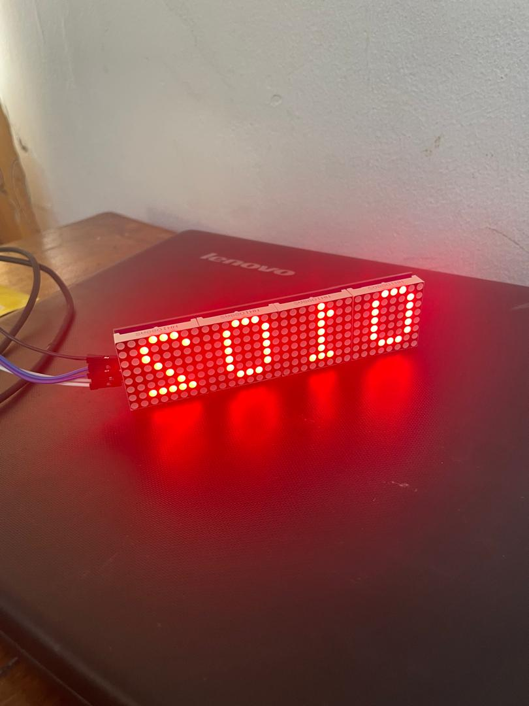

 Journa##l du Samedi 12 Septembre 2026 ( rédigé par APOUVI Amavi Michel)
# Fait aujourd'hui
- Essayage de connexion de la led matrix avec le ESP32 pour afficher un score  
# Appris 
- j'ai à créer un point d'accès wifi avec le **ESP32** 
# raté, puis corrigé 
- le score est affiché mais à l'envers 
# décidé
- J'ai décidé de revoir les fontions dans le code puis corrigé le code
# à faire demain 
- Non communiqué
- [signé] - Amavi Michel 