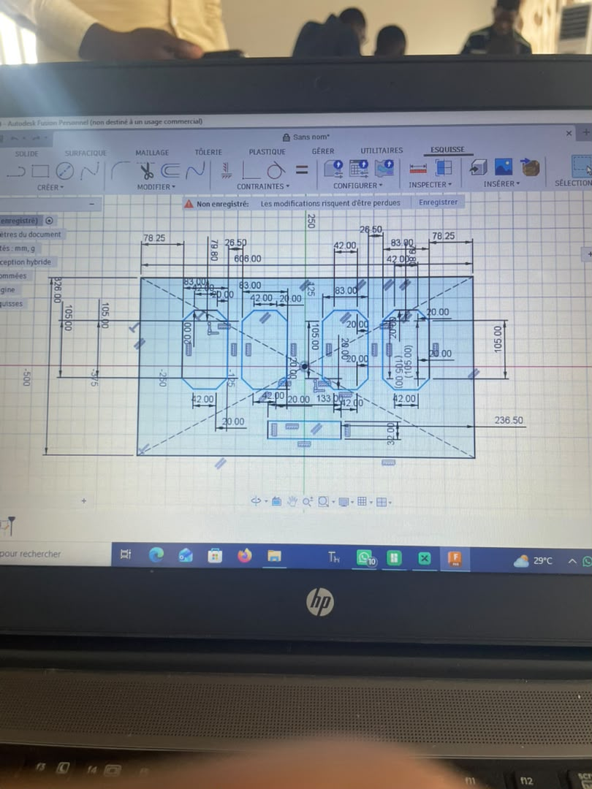
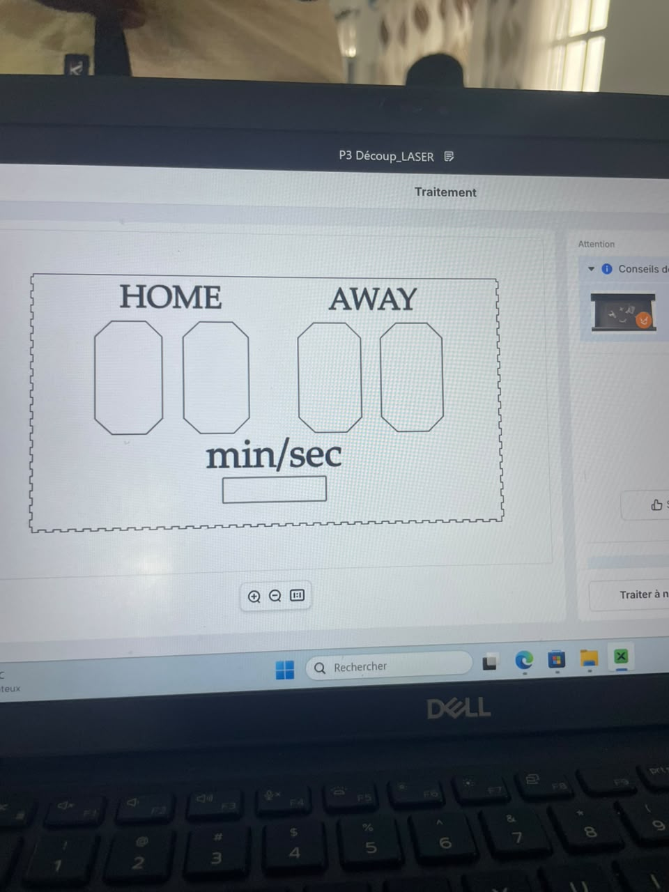
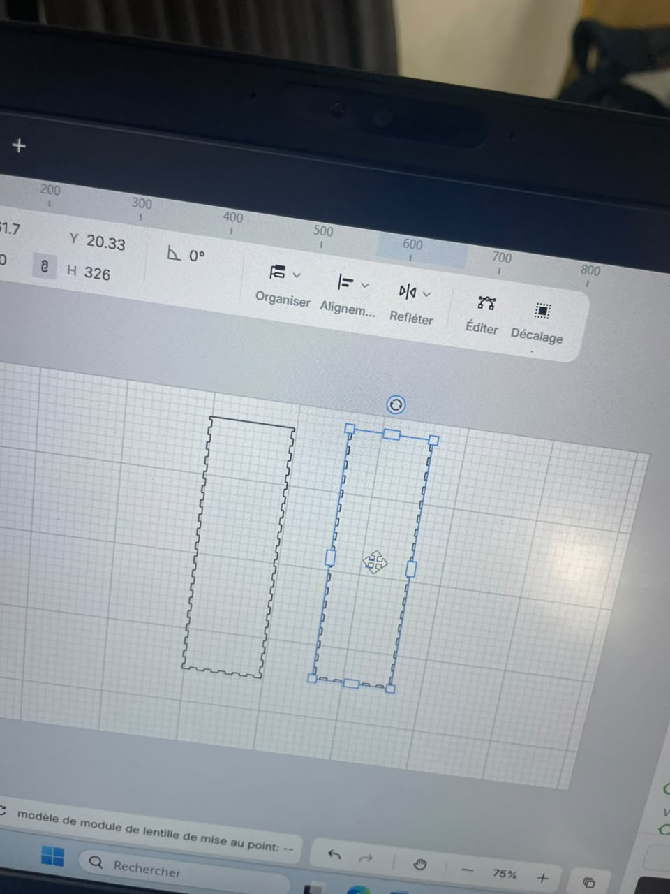
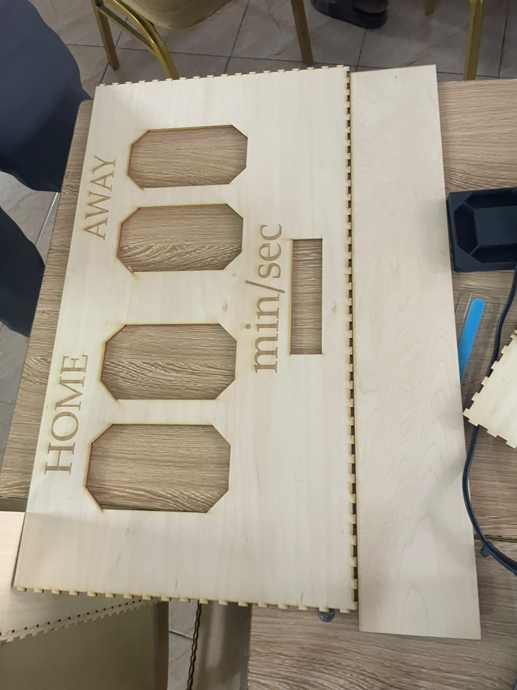
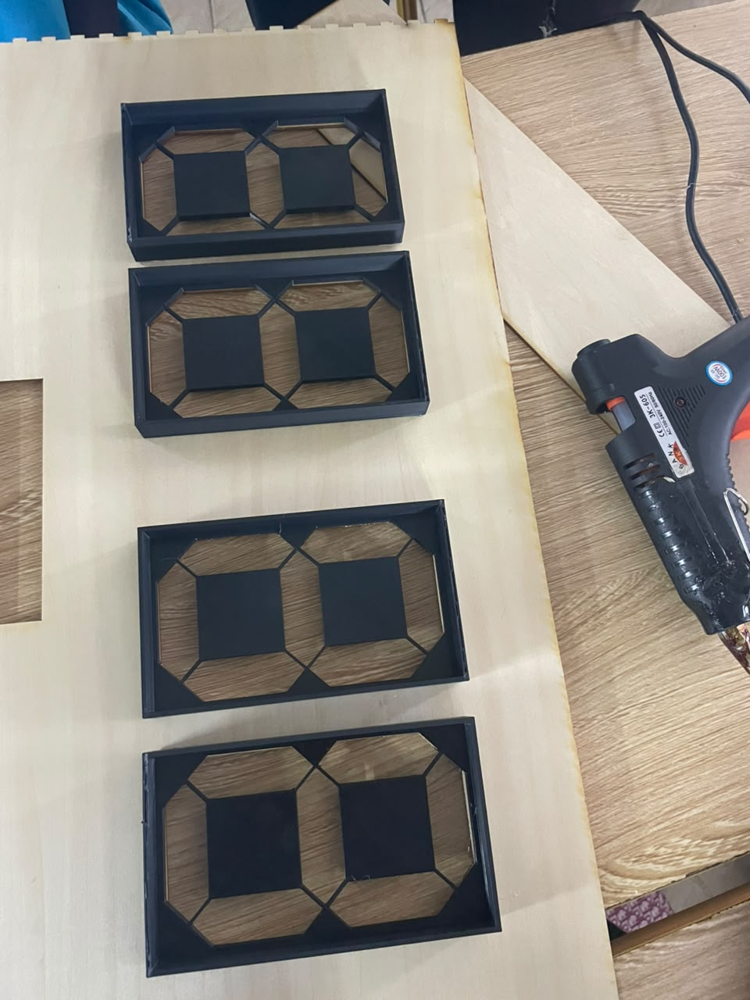
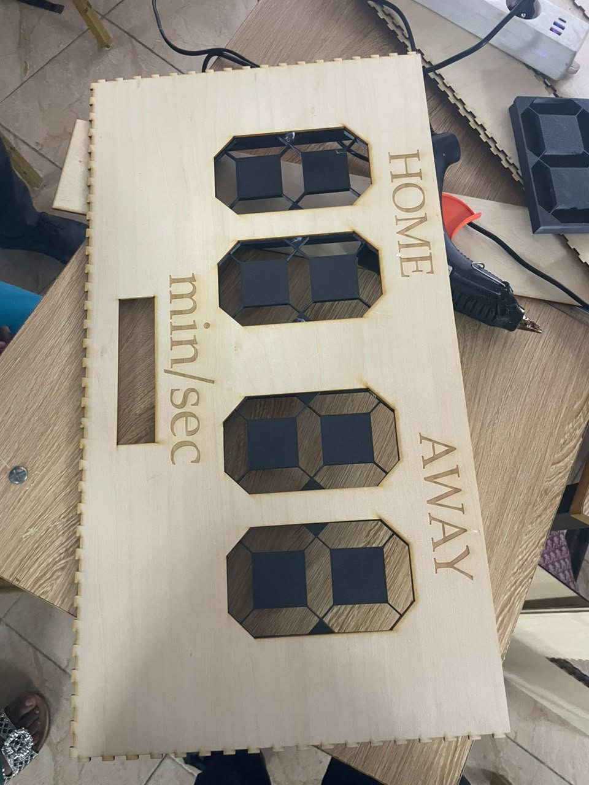

## Journal du Lundi 14 Septembre 2026 ( rédigé par : APOUVI Amavi Michel)
# Fait aujourdhui
- Conception du boitier pour le projet de groupe avec **Fusion** 
- Conception des bord du boitier avec **Makerspace**  
- Découpe du boitier avec le Laser  
- coller le boitier des LED au boitier du tableau  
# Appris 
- J'ai appris la conception des bords d'un boitier avec **Makerspace**
# à faire demain
- projet de groupe 
- [ signé] - Amavi Michel