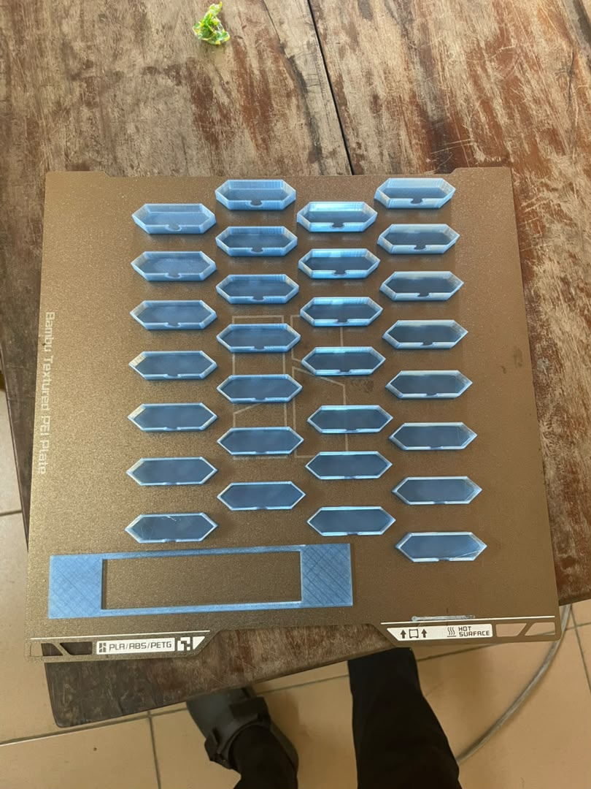
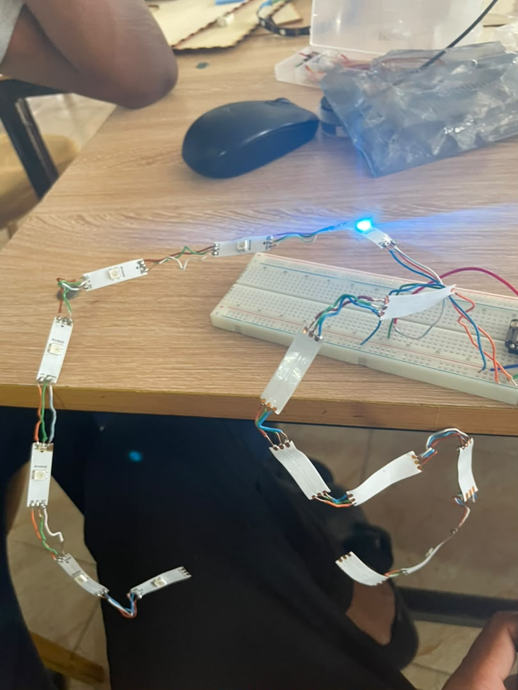

## Journal du Mardi 15 Septembre 2026(rédigé par : APOUVI Amavi Michel)
# Fait Aujourd'hui
- Conception et impression des couvre LED 
- J' ai soudé les Led 
# Appris 
- J'ai appris à souder les LED ruban 
# Raté puis corrigé
- J'ai raté la soudure de quelque broches des LED
# à faire demain
- travail de groupe 
- [ signé] - Amavi Michel