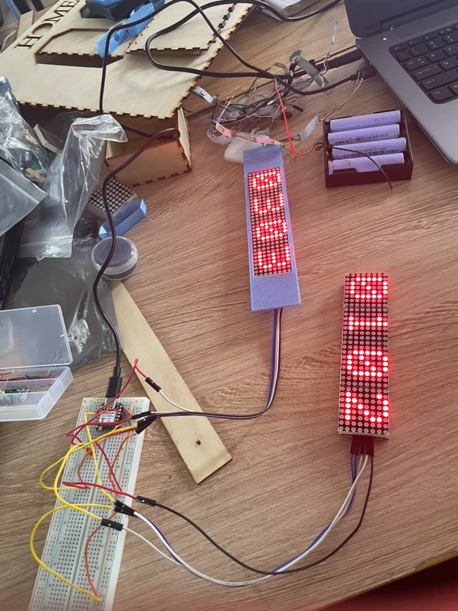
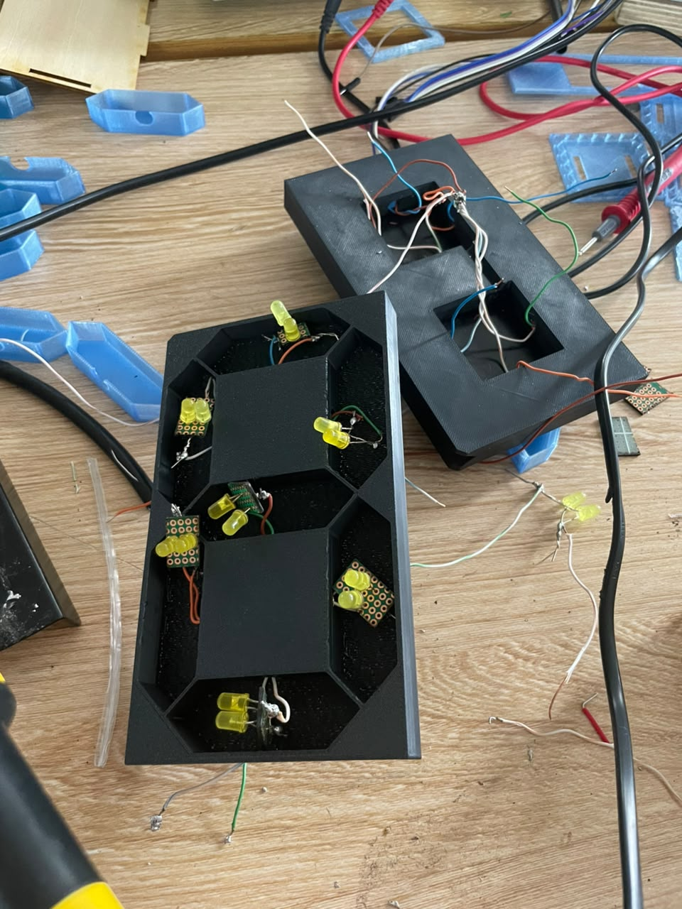
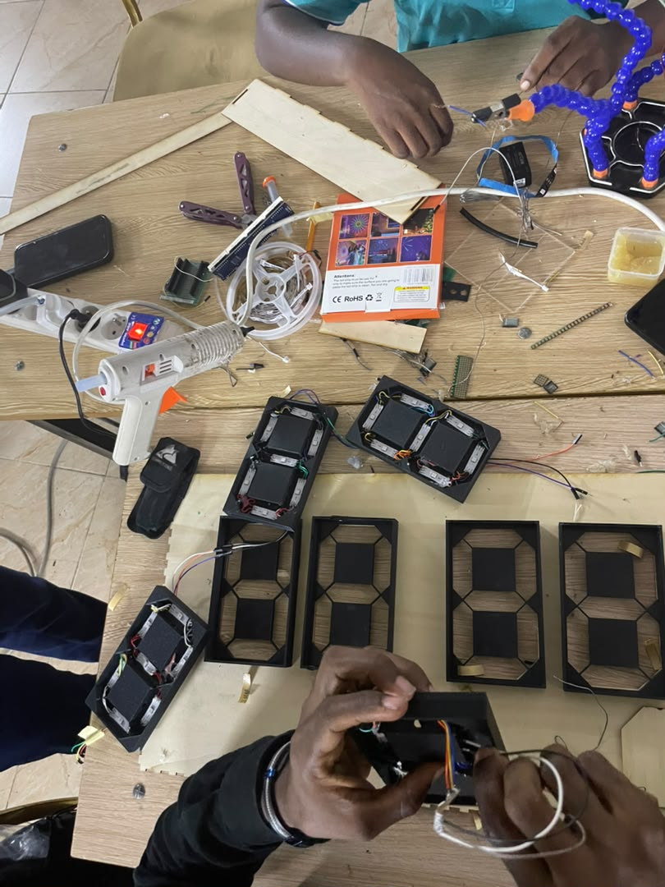
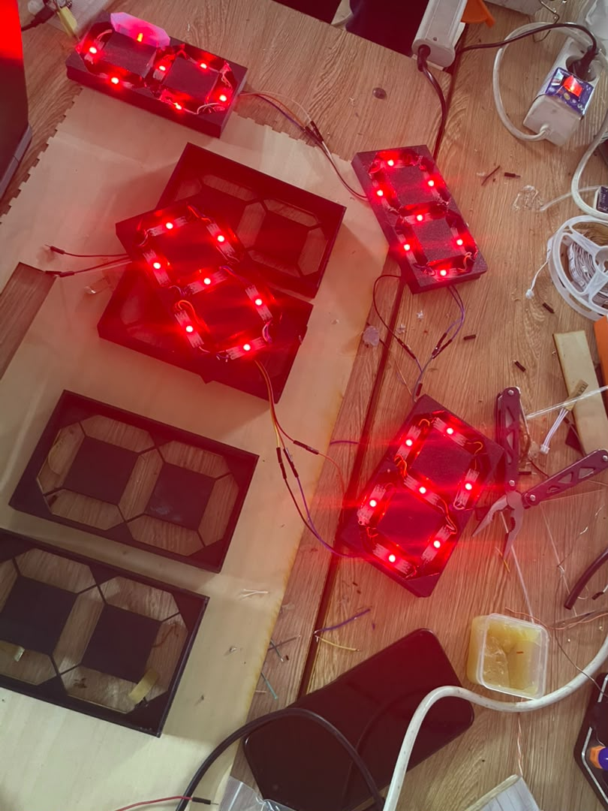

## Journal du Mercredi 15 Septembre 2026 ( rédigé par : APOUVI Amavi Michel)
# Fait aujourd'hui
- Test de notre projet en utulisant 02 **LED MATRIX** : l'un pour afficher **l'heure et l'autre pour afficher les score 
- soudure de petit led 
- soudure des **LED RUBAN** pour le projet  
# Appris
- J'ai appris une méthode simple pour souder les led 
# raté puis corrigé 
- le câblage des pétits 
- l'ajout du module de recharge et l'abaisseur de tension sur le système qui fonctionnait deja 
# décidé
- recommencé et refaire grâce aux conseil des formateurs
# à faire demain
- projet de groupe
- [ signé] - Amavi Michel 