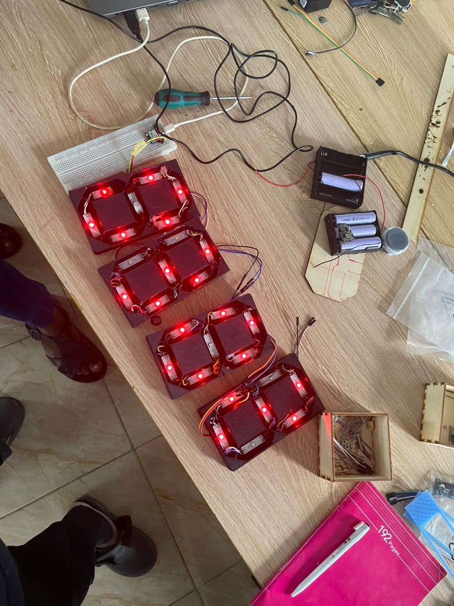
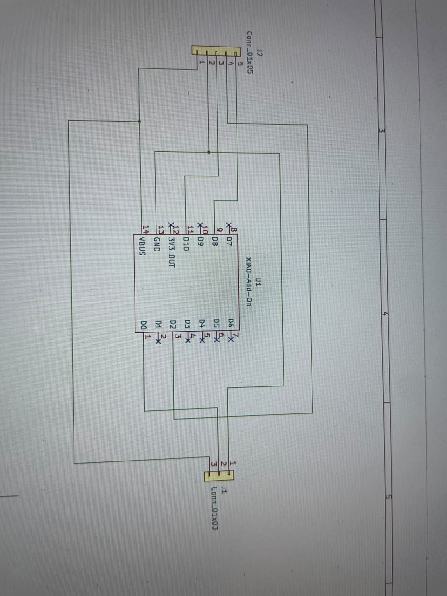
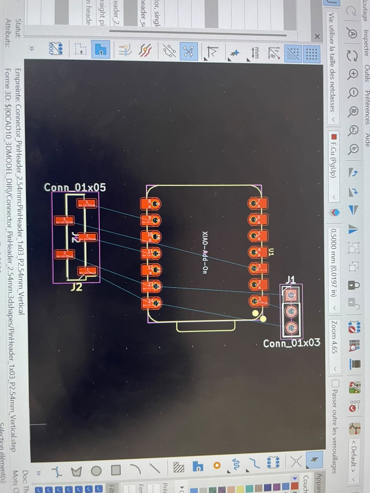

## Journal du jeudi 17 Septembre 2026 (rédigé par : APOUVI Amavi Michel)
# Fait Aujourd'hui
- Allumage des led souder hier avec un code mycro python 
- allumage des led souder et la led  avec un code micro python pour tester le cablage 
- conception du circuit du montage et de **PCB** 
- utilisation de plaquette perforer 
# Appris 
- j'ai appris la soudure d'un plaquette perforer
- j'ai à ajouter un module de charge et abaisseur de tension a un circuit
# raté puis corrigé 
- effet mirroire qui se trouve dans le code micro python
